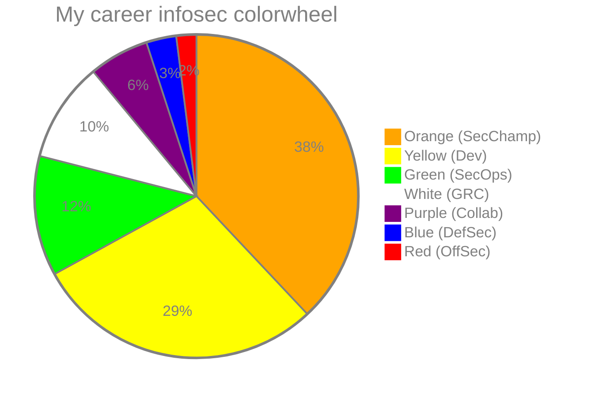
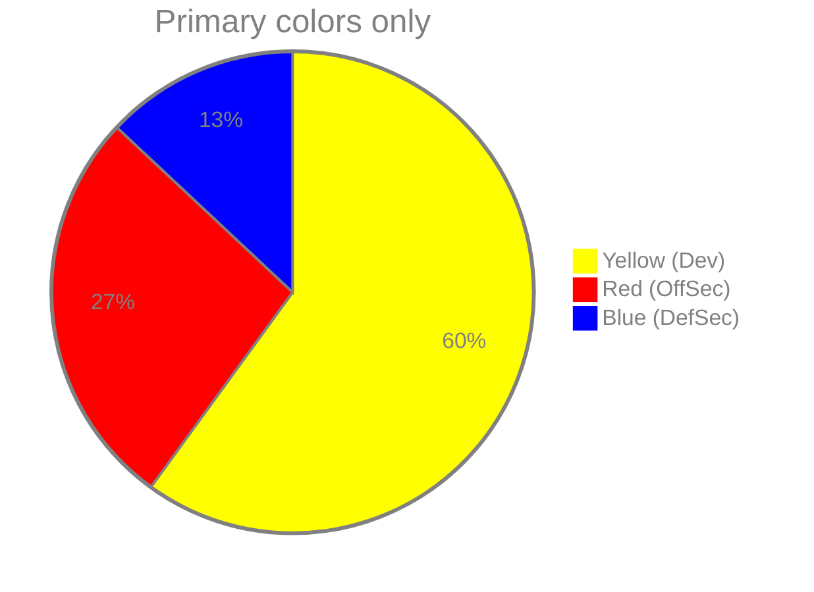
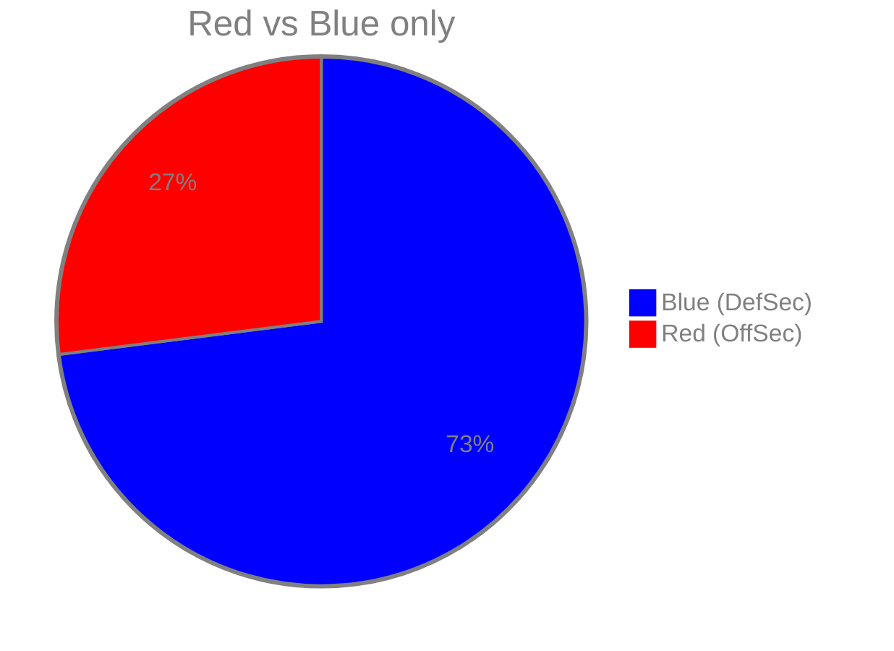

👋

Based on ~15.6 years of appsec work (2011 to 2026), mapped onto the InfoSec colour wheel.

## All colors

Orange (attackers inspiring builders) is the biggest slice. Green is security automation (builders improving defence). White (governance and audit) is my own addition to the wheel.

<!-- svg: colorwheel -->

## Primary colors only

Secondary colors split evenly between their parents (Orange = Red + Yellow, Green = Blue + Yellow, Purple = Red + Blue). White excluded.

<!-- svg: colorwheel-primary -->

## Red vs Blue only

Builder work counts as defence, Orange and Purple split evenly. White excluded. If Red means actual offensive operations, it is closer to 2%.

<!-- svg: colorwheel-redblue -->

[Introducing the InfoSec colour wheel — blending developers with red and blue security teams.](https://gh.io/infosec-color-wheel)