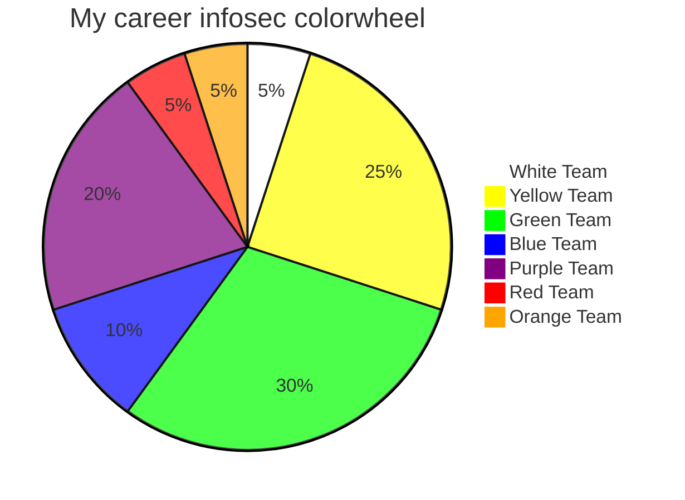

👋

[Introducing the InfoSec colour wheel — blending developers with red and blue security teams.
](https://hackernoon.com/introducing-the-infosec-colour-wheel-blending-developers-with-red-and-blue-security-teams-6437c1a07700)

